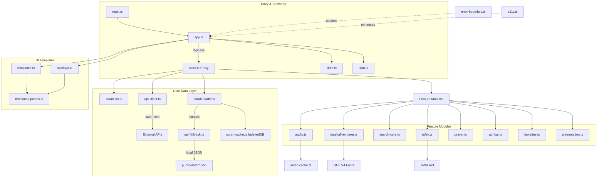

<div align="center">

# 📖 القرآن الكريم

تطبيق عربي للقرآن الكريم يتيح **القراءة والاستماع والبحث والتفسير والتأمل في الآية ومواقيت الصلاة والأذكار**، ويعمل في المتصفح وعلى أجهزة Android.

[📲 تحميل تطبيق Android](https://github.com/bahaback-hub/quran-app/releases/download/v3.1.20/quran-app-v3.1.20-official-uthmanic-hafs-debug.apk) · [🌐 تجربة التطبيق في المتصفح](https://bahaback-hub.github.io/quran-app/) · [🐛 الإبلاغ عن مشكلة](https://github.com/bahaback-hub/quran-app/issues) · [💡 اقتراح ميزة](https://github.com/bahaback-hub/quran-app/issues) · [💬 المناقشات](https://github.com/bahaback-hub/quran-app/discussions)

[](https://github.com/bahaback-hub/quran-app/releases/tag/v3.1.20)
[](https://github.com/bahaback-hub/quran-app/actions/workflows/ci.yml)
[](https://opensource.org/licenses/MIT)

---

## 📲 تثبيت التطبيق على Android

**الإصدار الحالي: 3.1.20.** لتثبيت التطبيق، نزّل [ملف APK](https://github.com/bahaback-hub/quran-app/releases/download/v3.1.20/quran-app-v3.1.20-official-uthmanic-hafs-debug.apk)، ثم افتحه من مجلد التنزيلات واختر **تثبيت**. يمكنك تثبيته فوق النسخة السابقة مباشرةً.

إذا طلب الهاتف إذنًا للتثبيت، فعّل مؤقتًا خيار **السماح بالتثبيت من هذا المصدر** للمتصفح أو مدير الملفات الذي فتحت منه الملف، ثم أعد إيقافه عند الانتهاء.

> هذه النسخة موقعة بتوقيع **Debug** ومخصصة للاختبار الميداني. ستستخدم النسخة العامة القادمة توقيع نشر مستقل قبل توزيعها على نطاق أوسع.

---

## 🏆 الجودة والاختبارات

هذا القسم يلخص ما تم التحقق منه داخل المشروع. وهو **تقييم فني داخلي** يوضح حالة الأدوات والاختبارات، وليس شهادة مستقلة من جهة خارجية.

| المجال | الحالة | ما تم التحقق منه |
|:---|:---:|:---|
| الاختبارات | ✅ | **3,740 اختبار وحدة و284 حالة اختبار للواجهة** عبر المتصفحات والهاتف. |
| الأمان | ✅ | تحليل CodeQL وفحص `npm audit` وسياسة محتوى صارمة والتحقق من الرخص. |
| إمكانية الوصول | ✅ | فحص تلقائي لمتطلبات WCAG، ودعم قارئ الشاشة والحركة المخففة والتركيز بلوحة المفاتيح. |
| الأداء | ✅ | تقسيم الشفرة، وقياس مؤشرات الأداء، وحدود أداء تلقائية في مسار البناء. |
| التوثيق والبناء | ✅ | تعليمات تطوير واختبار، وبوابات فحص للكود والأنواع والبناء والواجهة. |

---

## 🛡️ سير العمل CI/CD / CI/CD Workflows

| السير / Workflow | الوصف / Description |
|:---|:---|
| `ci.yml` | lint + typecheck + unit tests + coverage (≥ 80%) |
| `e2e.yml` | Playwright E2E إلزامي على **4 مشاريع**: chromium + firefox + webkit + mobile-chrome؛ يختبر الجوال تدفقات اللمس والاستجابة الخاصة به |
| `codeql.yml` | تحليل أمني عميق من GitHub |
| `zap-scan.yml` | **OWASP ZAP baseline scan** أسبوعي + عند PR |
| `lighthouse.yml` | Lighthouse CI إلزامي + تعليق على PR بالنتائج + رفع artifact |
| `a11y.yml` | axe-core على البناء النهائي (0 WCAG violations) |
| `bundle-size.yml` | تحليل حجم الحزمة + **Performance Budget** مُلزِم |
| `docs.yml` | توليد TypeDoc + نشر على GitHub Pages (`/api/`) |
| `security.yml` | `npm audit` مُلزِم + فحص الرخص |
| `release.yml` | نشر تلقائي عند tag |
| `deploy.yml` | نشر التطبيق على GitHub Pages |
| `labeler.yml` + `stale.yml` | أتمتة إدارة PRs والمسائل |

---

## 📊 نتائج Lighthouse الحقيقية / Verified Lighthouse Scores

<!-- LIGHTHOUSE-SCORES:START -->
<!-- يتم تحديث هذا القسم تلقائياً بواسطة scripts/update-lighthouse-badge.mjs -->
| Audit context | Performance | Accessibility | Best Practices | SEO | FCP | LCP | TBT | CLS |
|:---|---:|---:|---:|---:|---:|---:|---:|---:|
| Local production build, 2026-08-19 | 93 | 100 | 96 | 91 | 0.7s | 1.7s | 0ms | 0.003 |

> تُطبّق بوابة Lighthouse الآن الحدود نفسها المعرّفة في `performance-budget.json`. أزيل فحص فئة PWA من Lighthouse لأن الإصدارات الحديثة لم تعد تنشر هذه الفئة، بينما تستمر اختبارات PWA وE2E المنفصلة في تغطية سلوك التطبيق.
> Lighthouse now enforces the same thresholds defined in `performance-budget.json`. The obsolete Lighthouse PWA-category assertion was removed; dedicated PWA and E2E coverage remains in place.
<!-- LIGHTHOUSE-SCORES:END -->

---

## 📸 لقطات الشاشة / Screenshots

### 📖 وضع القراءة / Reading Mode


### 📄 وضع المصحف / Mushaf Mode


### 🖼️ وضع العرض / Presentation Mode


---

## 🌍 اللغات المدعومة / Supported Languages

| اللغة | Language | الاتجاه / Direction |
|-------|----------|---------------------|
| 🇸🇦 العربية | Arabic | RTL |
| 🇬🇧 English | English | LTR |
| 🇹🇷 Türkçe | Turkish | LTR |
| 🇲🇾 Bahasa Melayu | Malay | LTR |
| 🇮🇩 Bahasa Indonesia | Indonesian | LTR |

---

## ✨ المميزات / Features

### 📖 تلاوة القرآن / Quran Reading

| الميزة | الوصف |
|--------|-------|
| **نص قرآني كامل** | 114 سورة بالخط العثماني من AlQuran.cloud API |
| **تنقل بين السور** | قائمة منسدلة لجميع السور مع حفظ آخر موضع |
| **تظليل الآية الحالية** | إبراز الآية التي يتم تلاوتها تلقائياً |
| **علامات السجدة** | 15 علامة سجدة (واجبة/مستحبة) |
| **فواصل الأجزاء** | 30 جزء مع أيقونات بداية كل جزء |
| **شريط تقدم القراءة** | مؤشر تقدم مرتبط بالتمرير أعلى الصفحة |
| **التحكم بالخط** | حجم (16–45 بكسل)، نوع (Amiri, Scheherazade New, Reem Kufi)، تباعد الأسطر |
| **ترجمة معاني** | 5 ترجمات: Sahih International, Pickthall, Yusuf Ali, Hamidullah, Jalandhry |
| **ألوان التجويد** | 18 قاعدة تجويد بألوان مميزة (نهاري + ليلي) |
| **وضع الحفظ (حصن)** | إخفاء نص الآيات للتدريب على الاسترجاع |
| **خط حفص العثماني الرسمي** | خيار مرخّص للقراءة النصية من مجمع الملك فهد لطباعة المصحف الشريف. يُطبّق على وضع السورة فقط، بينما يبقى وضع المصحف الصفحي على QCF4 للحفاظ على تطابق الصفحات. |
| **بيانات المصحف الموثقة دون اتصال** | تنزيل اختياري لتخطيطات 604 صفحات وفهارسها بعد فحص بصمة SHA-256 لكل ملف. مصدرها مثبت بإصدار محدد وترخيص MIT، مع بقاء خطوط QCF4 خارج الحزمة إلى حين توفر إذن توزيع مكتوب. |

### 🎧 الاستماع الصوتي / Audio Playback

| الميزة | الوصف |
|--------|-------|
| **+30 قارئ** | العفاسي، عبد الباسط (مرتل/مجود)، الحصري، المنشاوي، السديس، الغامدي، الشريم، وأكثر |
| **مصدران صوتيان** | صوت لكل آية (API) + ملف MP3 كامل للسورة مع توقيتات (mp3quran.net) |
| **تظليل كلمة بكلمة** | متزامن مع طوابع زمنية للصوت عبر quran.com API |
| **التشغيل المتصل** | انتقال تلقائي للسورة التالية بعد انتهاء الحالية (زر 🔗 متصل) |
| **أوضاع التكرار** | إيقاف ← آية واحدة ← السورة كاملة ← نطاق مخصص (من/إلى/مرات) |
| **مؤقت النوم** | عداد تنازلي من 1 إلى 180 دقيقة مع إيقاف تلقائي |
| **تحكم بالسرعة** | تعديل سرعة التشغيل |
| **ضوابط شاشة القفل** | MediaSession API مع اسم السورة والآية |
| **محاولات إعادة تلقائية** | حتى محاولتين عند فشل التحميل مع تخطي عند الاستمرار |
| **مُحيّط صوتي** | أشرطة متحركة على Canvas أثناء التشغيل |
| **تشغيل من رقم الآية** | اضغط على ﴿٥﴾ لتشغيل الصوت من تلك الآية |
| **إشعار الختمة** | رسالة "تمت الختمة" عند الانتهاء من سورة الناس |

### 📥 التحميل بدون اتصال / Offline Audio

| الميزة | الوصف |
|--------|-------|
| **تحميل صوت السورة** | تخزين مؤقت لكل سورة/قارئ مع شريط تقدم |
| **ذاكرة IndexedDB** | حد أقصى 200 ميجابايت مع إخلاء تلقائي LRU |
| **إحصائيات التخزين** | عرض حجم البيانات المخزنة وإدارتها |
| **حذف المخزن** | حذف سور محددة أو مسح الكل |

### 🔍 البحث / Search

| الميزة | الوصف |
|--------|-------|
| **بحث في القرآن كاملاً** | يبحث في 6,236 آية فوراً |
| **بحث ذكي بالتشكيل** | يطابق النص مع أو بدون التشكيل (التشكيل العادي) |
| **إبراز النتائج** | تعليم المطابقات على النص الأصلي مع التشكيل |
| **اقتراحات تلقائية** | فهرس بادئات الكلمات مع عدد التكرارات |
| **سجل البحث** | حفظ آخر 10 عمليات بحث مع إمكانية الحذف |
| **بحث صوتي** | Web Speech API بالعربية 🎤 |
| **لوحة مفاتيح عربية** | لوحة كاملة على الشاشة مع Shift ومسح |
| **نتائج مُصفّحة** | 50 نتيجة لكل صفحة مع "تحميل المزيد" |
| **إجراءات النتائج** | تشغيل، نسخ، مشاركة، انتقال لكل نتيجة |

### 📜 التفسير / Tafsir

| الميزة | الوصف |
|--------|-------|
| **6 تفاسير** | الميسر، ابن كثير، الطبري، السعدي، البغوي، القرطبي |
| **تحميل ذكي** | ميسر محلي ← IndexedDB ← API |
| **لوحة جانبية** | ستارة منزلقة مع نص الآية والتفسير |
| **تكامل مع نافذة الآية** | عرض التفسير لأي آية بنقرة |
| **تخزين مؤقت** | IndexedDB `QuranTafsirDB` للوصول بدون اتصال |
| **نسخ التفسير** | من نافذة تفاصيل الآية |

### ✦ تأمل في الآية / Ayah Contemplation

تجربة تدبرية هادئة تفتح من **نافذة الآية نفسها**، بجوار إجراءات الفهم والنسخ والمشاركة. لا تقدّم تفسيراً بديلاً أو فتوى أو إجابات جاهزة؛ بل تعرض ثلاثة أسئلة تساعد القارئ على التوقف عند المعنى واللفظ والسياق.

| الميزة | الوصف |
|--------|-------|
| **ثلاثة أسئلة تدبرية** | أسئلة قصيرة حول معنى الآية وغايتها وترتيبها أو سياقها، من دون طلب إجابة من المستخدم. |
| **خصوصية أولاً** | لا يوجد حقل كتابة، ولا حساب، ولا سجل للتأملات، ولا تُرسل الآية أو أي تفاعل إلى خدمة ذكاء اصطناعي عند الاستخدام. |
| **بيانات محلية** | تُحمّل الأسئلة من ملف داخل التطبيق عند الحاجة، وتعمل بعد تحميلها من دون اتصال. |
| **موضع طبيعي** | اضغط على نص الآية، ثم اختر **«تأمل في الآية»** من نافذة التفاصيل. تظهر الأسئلة في نافذة سفلية على الهاتف ولوحة جانبية على سطح المكتب. |
| **تغطية تدريجية** | يظهر خيار التأمل فقط للآيات التي لديها ثلاثة أسئلة محلية مكتملة في الإصدار الحالي. وتُوسّع التغطية وتُراجع تحريرياً على دفعات. |

> **تنبيه تحريري:** أسئلة التأمل وسيلة للتدبر الشخصي وليست تفسيراً معتمداً للآيات ولا بديلاً عن الرجوع إلى مصادر التفسير الموثوقة.

### 📄 وضع المصحف / Mushaf Mode

| الميزة | الوصف |
|--------|-------|
| **خطوط QCF V4** | عرض الخط العثماني على Canvas |
| **604 صفحة** | تنقل بالصفحات مع شريط تمرير |
| **كشف الآية** | تحديد الآية المنقورة على Canvas للتشغيل والتفسير |
| **تظليل الآية الحالية** | مستطيلات متزامنة مع الصوت |
| **قائمة السور** | قائمة قابلة للبحث داخل وضع المصحف |
| **أسرار السورة** | معلومات وخصائص لكل سورة |
| **تحميل مسبق** | تحميل الصفحات المجاورة ±1 لتنقل سلس |
| **مخطط ألوان التجويد** | معروض أسفل صفحات المصحف |

### 🖼️ وضع العرض / Presentation Mode

| الميزة | الوصف |
|--------|-------|
| **عرض ملء الشاشة** | نص كبير وجميل للآيات |
| **خلفيات متعددة** | سادة، طبيعية (صور متكررة)، حسب المزاج، تلقائية (حسب الوقت)، متحركة (Ken Burns)، مشاهد Canvas |
| **مشاهد Canvas** | نجوم، أمواج، شفق قطبي، جسيمات، مطر |
| **خلفيات حسب الوقت** | فجر، صباح، ظهر، غروب، ليل |
| **تبديل التجويد** | تشغيل/إيقاف مستقل لكل عرض |
| **إخفاء تلقائي** | ضوابط تختفي بعد 3 ثوانٍ |
| **تنقل بلوحة المفاتيح** | أسهم، مسافة (تشغيل/إيقاف)، Escape |
| **تحجيم تلقائي** | تصغير الخط تلقائياً للآيات الطويلة على الجوال |
| **انتقالات متقاطعة** | تلاشي سلس بين الآيات |

### 🕌 مواقيت الصلاة / Prayer Times

| الميزة | الوصف |
|--------|-------|
| **أوقات تلقائية** | عبر Aladhan API حسب المدينة/البلد |
| **شريط المواقيت** | شريط قابل للطي يعرض الصلاة التالية + العد التنازلي |
| **6 أوقات** | الفجر، الشروق، الظهر، العصر، المغرب، العشاء |
| **تنبيه الأذان** | تشغيل أذان.mp3 عند دخول وقت الصلاة |
| **أذان الفجر** | تبديل منفصل لأذان الفجر |
| **إشعارات المتصفح** | تكامل مع Notification API |
| **التاريخ الهجري** | عرض عبر `Intl.DateTimeFormat` بتقويم أم القرى |
| **بوصلة القبلة** | بوصلة تفاعلية مع دعم اتجاه الجهاز وزاوية القبلة |
| **اختيار طريقة الحساب** | قابل للتخصيص (الافتراضي: أم القرى) |

### 📿 الأذكار / Adhkar

| الميزة | الوصف |
|--------|-------|
| **أذكار الصباح والمساء** | فئات معدة مسبقاً |
| **أذكار مخصصة** | إضافة أذكار خاصة بالمستخدم |
| **نظام العدّ** | اضغط للعد مع تتبع التقدم |
| **صوت إشعار** | رنين AudioContext عند إكمال الذكر |
| **جدولة الإشعارات** | تذكيرات في أوقات محددة |
| **إعادة تعيين يومية** | العدادات تصفر كل يوم تلقائياً |

### ⭐ المفضلة والعلامات / Favorites & Bookmarks

| الميزة | الوصف |
|--------|-------|
| **آيات مفضلة** | إضافة/إزالة بزر ❤️ |
| **لوحة المفضلة** | قائمة قابلة للتمرير مع إجراءات |
| **تصدير المفضلة** | كنص (.txt) أو JSON (.json) |
| **علامة مرجعية** | تعيين/انتقال بنقرة مزدوجة |
| **إجراءات متعددة** | انتقال، نسخ، مشاركة، حذف |

### 📊 إحصائيات القراءة / Reading Statistics

| الميزة | الوصف |
|--------|-------|
| **عدد الآيات المقروءة** | عداد تراكمي |
| **وقت القراءة** | تتبع بالساعات والدقائق |
| **عدد الجلسات** | عداد الجلسات |
| **سور فريدة** | عدد السور المقروءة |
| **سلسلة يومية** | تتبع الأيام المتتالية |
| **إعادة تعيين** | خيار تصفير الإحصائيات |

### 🎨 أنماط العرض / Visual Themes

| الميزة | الوصف |
|--------|-------|
| **الوضع النهاري** ☀️ | خلفية المسجد النبوي نهاراً + واجهة زجاجية |
| **وضع السيبيا** 📜 | خلفية ذهبية + واجهة دافئة |
| **الوضع الليلي** 🌙 | خلفية المسجد ليلاً + واجهة داكنة |
| **كشف تلقائي** | يتبع إعدادات النظام `prefers-color-scheme` |
| **زجاج ضبابي** | `backdrop-filter: blur()` على جميع اللوحات |

### 📤 المشاركة / Sharing

| الميزة | الوصف |
|--------|-------|
| **مشاركة أصلية** | Capacitor Share على Android، وWeb Share API في المتصفح، مع نسخ النص كبديل عند التعذر |
| **نسخ بتشكيل** | نسخة كاملة بالتشكيل |
| **نسخ بدون تشكيل** | تجريد التشكيل |
| **واتساب** | رابط مشاركة مباشر |
| **تيليجرام** | رابط مشاركة مباشر |
| **تحديد متعدد** | اختيار عدة آيات ومشاركتها معاً |

### ⌨️ اختصارات لوحة المفاتيح / Keyboard Shortcuts

| المفتاح | الإجراء |
|---------|---------|
| `Space` | تشغيل / إيقاف |
| `←` / `→` | الآية السابقة / التالية |
| `S` / `D` | السورة السابقة / التالية |
| `H` | وضع الحفظ |
| `R` | تدوير أوضاع التكرار |
| `B` | تعيين علامة مرجعية |
| `G` | الانتقال للعلامة |
| `F` | تبديل المفضلة |
| `T` | تبديل التفسير |
| `N` | تبديل الوضع الليلي |
| `M` | تبديل وضع المصحف |
| `P` | تبديل وضع العرض |
| `+` / `-` | تكبير / تصغير الخط |
| `0` | إعادة حجم الخط |
| `Ctrl+F` | التركيز على البحث |
| `Escape` | إغلاق اللوحات |

### ♿ إمكانية الوصول / Accessibility

| الميزة | الوصف |
|--------|-------|
| **فخ التركيز** | للنوافذ واللوحات المنزلقة |
| **إعلانات قارئ الشاشة** | مناطق ARIA الحية (مهذب/عاجل) |
| **إدارة التركيز** | فتح/إغلاق ذكي للوحات |
| **اختصار تخطي** | رابط "تخطي إلى المحتوى" |
| **كشف الحركة المنخفضة** | تعطيل الرسوم المتحركة تلقائياً |
| **التباين العالي** | كشف `prefers-contrast: high` |
| **التركيز بلوحة المفاتيح** | إبراز فقط عند التنقل بلوحة المفاتيح |

### ⚙️ الإعدادات / Settings

| الميزة | الوصف |
|--------|-------|
| **لوحة مبوبة** | تنظيم حسب الفئات |
| **إعدادات الموقع** | المدينة، البلد، طريقة الحساب |
| **إعدادات العرض** | حجم الخط، نوعه، تباعد الأسطر |
| **إعدادات الصلاة** | تبديل الأذان، أذان الفجر، اختبار الأذان |
| **استيراد/تصدير** | حفظ وتحميل الإعدادات كـ JSON مع التحقق من الأنواع |
| **إعادة تعيين** | نافذة تأكيد مخصصة |

---

## 🛠️ التقنيات / Tech Stack

| الفئة | التقنية |
|-------|---------|
| **اللغة** | TypeScript 6.0 (وضع صارم) |
| **البناء** | Vite 8 مع LightningCSS |
| **PWA** | vite-plugin-pwa (Workbox) |
| **أندرويد** | Capacitor 8 (@capacitor/android, app, share, splash-screen, status-bar) |
| **الاختبار** | Vitest 4 (وحدات)، Playwright 1.60 (E2E) |
| **فحص الكود** | ESLint 9 + typescript-eslint |
| **التنسيق** | Prettier 3 |
| **إدارة الحالة** | نظام Proxy تفاعلي مخصص (بدون إطار عمل) |
| **الخطوط** | Amiri، Scheherazade New، Reem Kufi (Google Fonts) |
| **واجهات API** | AlQuran.cloud، Aladhan (الصلاة)، Tafsir API (jsDelivr)، mp3quran.net، quran.com |
| **التخزين** | localStorage + 3 قواعد IndexedDB (QuranAppDB، QuranAudioCacheDB، QuranTafsirDB) |

---

## 🚀 البدء السريع / Quick Start

### المتطلبات / Requirements
- Node.js 22+

### التثبيت / Install
```bash
git clone https://github.com/bahaback-hub/quran-app.git
cd quran-app
npm install
```

### التطوير / Development
```bash
npm run dev          # خادم التطوير على المنفذ 3000
```

### البناء / Build
```bash
npm run build        # بناء للإنتاج
npm run preview      # معاينة البناء
```

### الاختبار / Testing
```bash
npm test                    # جميع الاختبارات الوحدية
npm run test:watch          # اختبارات في وضع المراقبة
npm test -- --coverage      # مع تقرير التغطية
npm run test:e2e            # اختبارات E2E (Playwright)
```

### فحص الكود / Code Quality
```bash
npm run lint         # فحص ESLint
npm run lint:fix     # إصلاح تلقائي
npm run format       # تنسيق Prettier
npm run format:check # فحص التنسيق
npm run typecheck    # فحص أنواع TypeScript
```

### بناء أندرويد / Android Build
```bash
npm run android:build   # بناء + مزامنة Capacitor
npm run android:open    # فتح في Android Studio
npm run android:run     # بناء + تشغيل على الجهاز
```

> لتنزيل التطبيق فقط، لا تحتاج إلى بناء المشروع؛ استخدم [ملف APK 3.1.20 المباشر](https://github.com/bahaback-hub/quran-app/releases/download/v3.1.20/quran-app-v3.1.20-official-uthmanic-hafs-debug.apk).

---

## 📁 هيكل المشروع / Project Structure

```
quran-app/
├── .github/workflows/        # CI/CD pipeline
├── src/
│   ├── __tests__/            # اختبارات وحدية (Vitest + jsdom + fake-indexeddb)
│   ├── css/                  # أنماط CSS معيارية (17 ملف)
│   │   ├── variables.css     # متغيرات التصميم
│   │   ├── base.css          # الأنماط الأساسية
│   │   ├── layout.css        # التخطيط
│   │   ├── surah.css         # أنماط السورة والآيات
│   │   ├── player.css        # المشغل العائم
│   │   ├── panels.css        # اللوحات الجانبية
│   │   ├── mushaf.css        # وضع المصحف
│   │   ├── modals.css        # النوافذ المنبثقة
│   │   ├── components.css    # المكونات المشتركة
│   │   ├── animations.css    # الرسوم المتحركة
│   │   ├── glass-*.css       # تأثيرات الزجاج (3 أنماط)
│   │   ├── responsive.css    # التصميم المتجاوب
│   │   ├── accessibility.css # أنماط إمكانية الوصول
│   │   ├── help.css          # لوحة التعليمات
│   │   └── capacitor.css     # أنماط أندرويد
│   ├── translations/         # ملفات الترجمة (ar, en, tr, ms, id)
│   ├── main.ts               # نقطة الدخول
│   ├── app.ts                # تهيئة التطبيق (3 مراحل)
│   ├── state.ts              # إدارة الحالة التفاعلية (Proxy)
│   ├── dom.ts                # تخزين مؤقت لعناصر DOM
│   ├── audio.ts              # مشغل الصوت المتقدم
│   ├── audio-cache.ts        # تخزين مؤقت صوتي (IndexedDB + LRU)
│   ├── i18n.ts               # نظام الترجمة الديناميكي
│   ├── templates.ts          # قوالب HTML آمنة من XSS
│   ├── overlays.ts           # حقن القوالب المتأخر
│   ├── api-client.ts         # عميل API موحد (مهلة + إعادة محاولة + إلغاء مكرر)
│   ├── error-boundary.ts     # معالجة أخطاء شاملة
│   ├── surah-loader.ts       # تحميل السور (3 مستويات)
│   ├── mushaf.ts             # وضع المصحف (QCF V4 Canvas)
│   ├── presentation.ts       # وضع العرض التقديمي
│   ├── search-core.ts        # محرك البحث مع Trie
│   ├── search-ui.ts          # واجهة البحث
│   ├── prayer.ts             # مواقيت الصلاة + الأذان
│   ├── tafsir.ts             # التفاسير (6 إصدارات)
│   ├── tajweed.ts            # ألوان التجويد (18 قاعدة)
│   ├── tajweed-data.ts       # بيانات التجويد
│   ├── reciters.ts           # قائمة القراء (+30)
│   ├── favorites.ts          # المفضلة والتصدير
│   ├── adhkar.ts             # الأذكار والإشعارات
│   ├── keyboard.ts           # اختصارات لوحة المفاتيح
│   ├── navigation.ts         # نظام التنقل
│   ├── a11y.ts               # أدوات إمكانية الوصول
│   ├── settings.ts           # الإعدادات والاستعادة
│   ├── storage.ts            # تخزين localStorage آمن
│   ├── ui.ts                 # عناصر واجهة المستخدم
│   ├── ui-extras.ts          # مهام واجهة إضافية
│   ├── ayah-modal.ts         # نافذة تفاصيل الآية
│   ├── contemplation.ts       # تحميل أسئلة التأمل المحلية وعرضها
│   ├── contemplation-questions.sample.ts # عينة الفاتحة المحررة
│   ├── capacitor-back.ts     # زر الرجوع لأندرويد
│   └── ...                   # ملفات أخرى
├── index.html                # الصفحة الرئيسية
├── styles.css                # ملف الأنماط الرئيسي (imports معيارية)
├── vite.config.js            # إعدادات Vite + PWA
├── vitest.config.ts          # إعدادات Vitest
├── tsconfig.json             # إعدادات TypeScript صارمة
└── eslint.config.js          # إعدادات ESLint
```

---

## 🏗️ العمارة / Architecture

### مخطط المكونات / Component Diagram



### إدارة الحالة التفاعلية / Reactive State Management
بدون أي إطار عمل خارجي — يستخدم `Proxy` لإنشاء حالة تفاعلية بأنواع آمنة:
```typescript
state.isPlaying = true;  // ← يُخطر المشتركين تلقائياً
subscribe('isPlaying', (newVal, oldVal) => { ... });  // ← أنواع آمنة
batch(() => { state.currentSurah = 5; state.currentAyahIndex = 0; });  // ← إخطار واحد
```

### التهيئة المتتابعة / 3-Phase Bootstrap
التطبيق يتبع 3 مراحل لتسريع التحميل:
1. **المسار الحاسم**: الحالة، DOM، الإعدادات، قائمة السور، تحميل أول سورة
2. **ربط الأحداث**: التنقل، لوحة المفاتيح، إمكانية الوصول، اللغة
3. **المهام المؤجلة**: الساعة، الصلاة، الأذكار، المفضلة، النوافذ، فهرس البحث

### عميل API موحد / Unified API Client
`safeFetch` يوفر: مهلة زمنية (15 ثانية)، إعادة محاولة (مرتان)، إلغاء الطلبات المكررة، AbortController، وإشعارات خطأ صديقة.

### تحميل البيانات على 4 مستويات / 4-Tier Data Loading
1. **محلي مُخزّن مؤقتاً**: IndexedDB (نصوص، صوت، تفاسير)
2. **API البعيد**: AlQuran.cloud، Aladhan، mp3quran.net
3. **ذاكرة البحث**: `state.fullQuranText` (محمل مسبقاً)
4. **Fallback محلي**: `public/data/quran-uthmani.json` (1.7MB، يعمل offline بالكامل)

### حقن القوالب المتأخر / Lazy Overlay Injection
القوالب الكبيرة (الإعدادات، المشغل، لوحة المفاتيح، التعليمات) تُحقن عبر JavaScript قبل `cacheDom()`، مما يقلل حجم HTML الأولي بنحو 375 سطر.

---

## 🔒 الأمان / Security

| الميزة | الوصف |
|--------|-------|
| **Content Security Policy** | سياسة أمان محتوى صارمة في HTML meta tag |
| **قوالب آمنة من XSS** | جميع HTML تمر عبر `escapeHtml()` |
| **التحقق من أنواع الإعدادات** | allowlist + type validation عند الاستيراد |
| **Referrer Policy** | `strict-origin-when-cross-origin` |
| **X-Content-Type-Options** | `nosniff` |

---

## 🤝 المساهمة / Contributing

1. Fork المشروع
2. أنشئ فرع جديد (`git checkout -b feature/amazing-feature`)
3. التزم بالتغييرات (`git commit -m 'Add amazing feature'`)
4. ارفع الفرع (`git push origin feature/amazing-feature`)
5. افتح Pull Request

تأكد من اجتياز جميع الفحوصات:
```bash
npm run lint && npm run typecheck && npm test
```

---

## 📄 الرخصة / License

هذا المشروع مرخص تحت [MIT License](LICENSE).

---

<div align="center">

**اللهم اجعل هذا العمل في ميزان أعمال عائلة السليماني**

البيانات من [AlQuran.cloud API](https://alquran.cloud/) و [Tafsir API](https://github.com/spa5k/tafsir_api)

</div>
